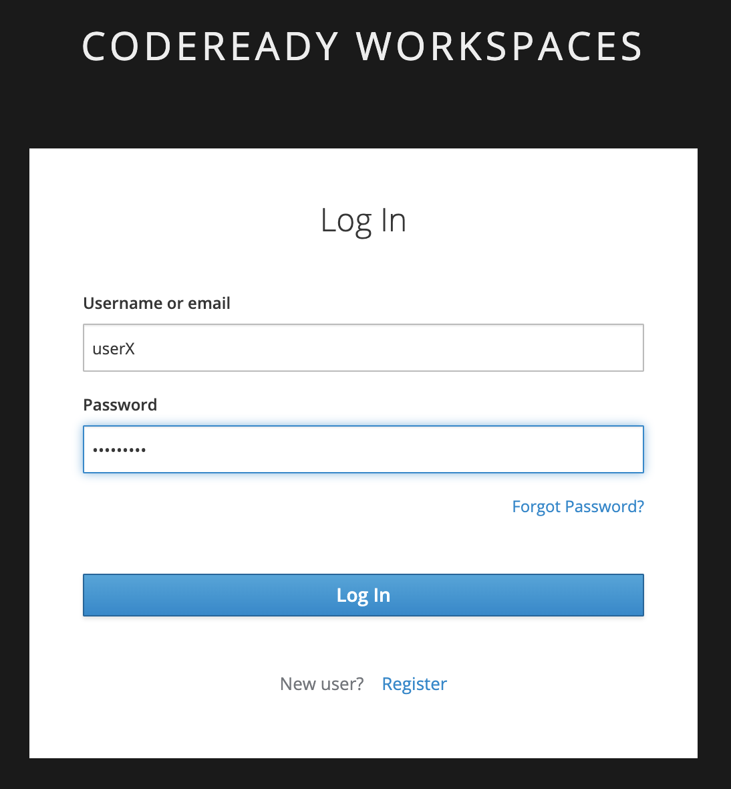
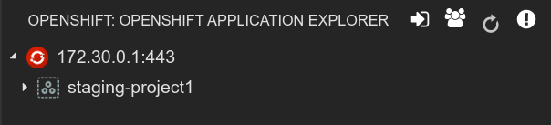
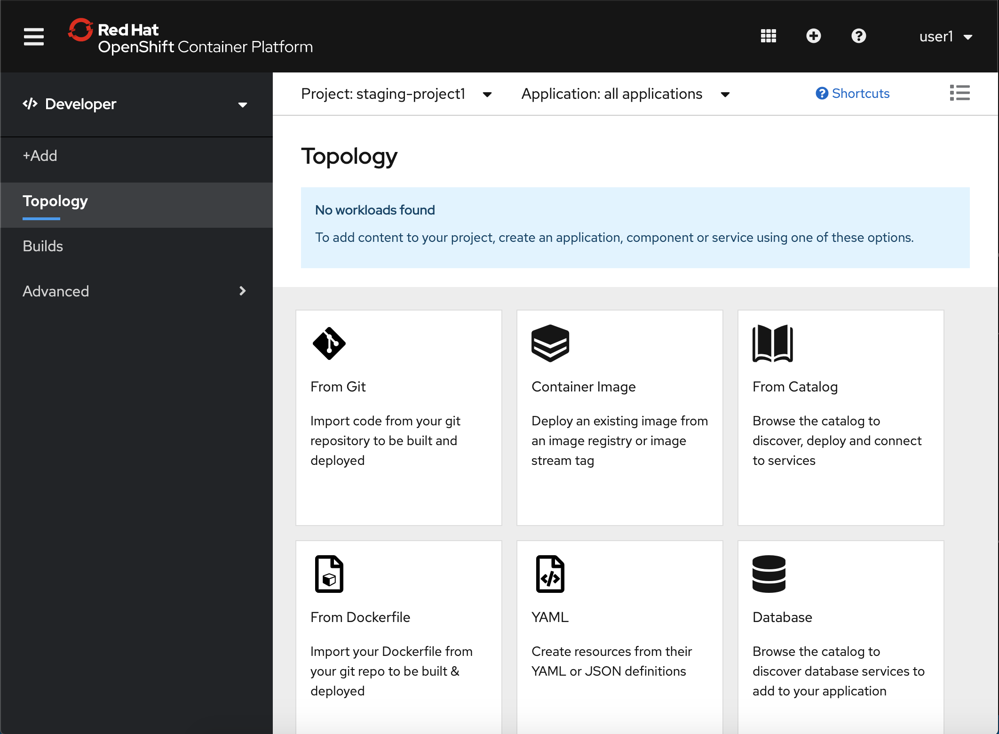

:CHE_URL: %CHE_URL%
:USER_ID: %USER_ID%
:OPENSHIFT_PASSWORD: %OPENSHIFT_PASSWORD%
:OPENSHIFT_CONSOLE_URL: %OPENSHIFT_CONSOLE_URL%/topology/ns/staging-project{USER_ID}

_15 MINUTES PRACTICE_

.Cast Away. Robert Zemeckis (DreamWorks Pictures)
[caption=" "]

After a long and frustrating morning spending hours to solve an issue that a colleague, passing by chance with his/her 
cup of coffee, fixed in literally 5 seconds, you are finally ready to start your normal working day when ...

Your manager suddenly comes out of his/her office and walks to you with the very known face that saying *"You are in trouble!"*.
Indeed, the new release of a ***Mysterious Application*** is planned for tonight (everything is always urgent) and it seems to contain some bugs.

And of course, the developer who worked on this last release is now drinking some mojitos on the paradise island and you are the 
only one available who can save the situation. Your manager points the source code https://github.com/mcouliba/cloud-native-labs/tree/debugging[Mysterious Application^] out, 
gives you a gentle tap on the shoulder and says "Bon Courage!".

At that moment in time, you feel like you are on an island, but not the same one than your colleague.

Now you have to:

* Identify the right tools to build and run the ***Mysterious Application***
* Install them on your environment
* Build your application which could be composed by several heterogeneous languages
* Test, deploy, run it
* ...

Piouf!! Lots of things to do in a short period of time...

*"Don't Worry, Be Happy"*, Red Hat OpenShift Container Platform, Inc is here to help!!

You have *NOTHING* to install on your own LAPTOP. Just use your *Chrome Browser* during this lab. 

'''

=== What is CodeReady Workspaces?

[sidebar]
--
image::images/codereadyworkspaces-logo.png[CodeReady Workspaces, 400]

https://access.redhat.com/products/red-hat-codeready-workspaces[CodeReady Workspaces^] is a Kubernetes-native IDE and developer collaboration platform.

As an open-source project, the core goals of https://access.redhat.com/products/red-hat-codeready-workspaces[CodeReady Workspaces^] are to:

* **Accelerate project and developer onboarding:** As a zero-install development environment that runs in your browser, https://access.redhat.com/products/red-hat-codeready-workspaces[CodeReady Workspaces^]  makes it easy for anyone to join your team and contribute to a project.
* **Remove inconsistency between developer environments:** No more: “But it works on my machine.” Your code works exactly the same way in everyone’s environment.
* **Provide built-in security and enterprise readiness:** As https://access.redhat.com/products/red-hat-codeready-workspaces[CodeReady Workspaces^]  becomes a viable replacement for VDI solutions, it must be secure and it must support enterprise requirements, such as role-based access control and the ability to remove all source code from developer machines.

To achieve those core goals, https://access.redhat.com/products/red-hat-codeready-workspaces[CodeReady Workspaces^]  provides:

* **Workspaces:** Container-based developer workspaces providing all the tools and dependencies needed to code, build, test, run, and debug applications.
* **Browser-based IDEs:** Bundled browser-based IDEs with language tooling, debuggers, terminal, VCS integration, and much more.
* **Extensible platform:** Bring your own IDE. Define, configure, and extend the tools that you need for your application by using plug-ins, which are compatible with Visual Studio Code extensions.
* **Enterprise Integration:** Multi-user capabilities, including Keycloak for authentication and integration with LDAP or AD.
--

'''

=== Getting your Developer Workspace with a single click

https://access.redhat.com/products/red-hat-codeready-workspaces[CodeReady Workspaces^]  will provide you an out-of-box 
*Developer Workspace* with all the tools and the dependencies we need to do the job. **And with only one single click!**

[NOTE]
.Devfile
====
https://access.redhat.com/products/red-hat-codeready-workspaces[CodeReady Workspaces^] uses https://access.redhat.com/products/red-hat-codeready-workspacesdocs/che-7/making-a-workspace-portable-using-a-devfile/[Devfiles^] to automate the provisioning 
of a specific workspace by defining:

* projects to clone
* browser IDE to use
* preconfigured commands
* tools that you need
* application runtime definition

Providing a https://github.com/mcouliba/debugging-workshop/blob/master/devfile.yaml[devfile.yaml^] file inside a Git source repository signals to https://access.redhat.com/products/red-hat-codeready-workspaces[CodeReady Workspaces^] to configure the project and runtime according 
to this file.
====

Click on the below button called `**Developer Workspace**`

[link={CHE_URL}/dashboard/#/ide/user{USER_ID}/wksp-debugging]
[window=_blank, align="center"]
image::images/developer-workspace-button.svg[Developer Workspace - Button, 300]

Then login as `**user{USER_ID}/{OPENSHIFT_PASSWORD}**`, let's the magic happens...

Once completed, you will have a fully functional Browser-based IDE with the source code already imported.

image::images/che-workspace.png[Che - Workspace, 800]

'''
To go further with *RedHat Codeready Workspaces*  follow http://https://developers.redhat.com/products/codeready-workspaces/overview[this link]

=== What is OpenShift Connect?

[sidebar]
.OpenShift Connector
--
image::images/openshiftconnect-logo.png[OpenShift Connector logo, 150]

https://marketplace.visualstudio.com/items?itemName=redhat.vscode-openshift-connector[OpenShift Connector^]
is a Visual Studio (VS) Code extension for interacting with Red Hat OpenShift cluster with more improved features for seamless developer experience.

Developers can now focus on higher-level abstractions like their application and components and can drill down deeper to get to the OpenShift and 
Kubernetes resources that make up their application directly from CodeReady Workspaces.

Three major benefits:

The new OpenShift Connector 0.1.1 features offer three major benefits:

* Speeds up OpenShift development by supporting fully integrated OpenShift development and deployment within CodeReady Workspaces, 
which lets you connect to any OpenShift cluster and create, debug, and deploy from the IDE itself.
* Simplifies inner-loop development for cloud infrastructure, since under the hood this extension uses tools like 
https://docs.openshift.com/container-platform/4.2/cli_reference/openshift_developer_cli/understanding-odo.html[OpenShift Do (odo)^],
a fast and simple CLI tool for creating applications on Red Hat OpenShift Container Platform and 
https://docs.openshift.com/container-platform/4.2/cli_reference/openshift_cli/getting-started-cli.html[OpenShift CLI (oc)^] 
to help you interact with the local or production OpenShift instance and complete the inner-loop experience.
* Enhances developer workflow by providing a streamlined developer experience for working with OpenShift instances (3.x or 4.x) 
and supporting public cloud instances such as Red Hat OpenShift on Azure and AWS.

https://marketplace.visualstudio.com/items?itemName=redhat.vscode-openshift-connector[OpenShift Connector^] on CodeReady Workspaces provides an end-to-end developer experience for interacting with a Red Hat OpenShift cluster. 
By leveraging the IDE features, developers can create, deploy, and debug applications and then deploy directly to 
the running OpenShift cluster.
--

'''

=== Connect Your Workspace to Your OpenShift User

First, in your link:{CHE_URL}[Workspace^], open the `**OpenShift View**` by clicking on the OpenShift icon of the left hand side.

image::images/che-openshift-view.png[Che - OpenShift View, 300]

Then, click the `**Log in to cluster**` icon and confirm you want to connect to a different cluster

image::images/che-openshift-login-popup.png[Che - OpenShift Login Popup, 500]

Finally, *enter the following information*:

.OpenShift Log in
[%header,cols=2*]
|===
|Parameter 
|Value

|Select the way to log in to the cluster.
|Credentials

|Provide cluster URL to connect.
|https://172.30.0.1:443

|Select username for basic authentication to the API Server
|$(plus) Add new user...

|Provide Username for basic authentication to the API Server
|user{USER_ID}

|Provide Password for basic authentication to the API Server
|{OPENSHIFT_PASSWORD}

|===

You should see one project in the **OpenShift View**  - `**staging-project{USER_ID}**` **project**  which will be used as a **Staging Environment**.

'''

=== Log in to the OpenShift Developer Console

OpenShift ships with a web-based console that will allow users to
perform various tasks via a browser.

Click on the below button called `**Developer Console**`

[link={OPENSHIFT_CONSOLE_URL}]
[window=_blank, align="center"]
image::images/developer-console-button.png[Developer Workspace - Button, 300]

Enter your username and password (`**user{USER_ID}/{OPENSHIFT_PASSWORD}**`) and
then log in. After you have authenticated to the web console, you will be presented with a
list of projects that your user has permission to work with. 

Select the `**Developer View**` then your `**staging-project{USER_ID}**` to be taken to the project overview page
which will list all of the routes, services, deployments, and pods that you have
running as part of your project. There's nothing there now, but that's about to
change.

'''

=== CONGRATULATIONS!!!

You find a friend *Wilson* aka OpenShift. Everything **seems** doing great but... 

.Cast Away. Robert Zemeckis (DreamWorks Pictures)
[caption=" "]

You are now ready to tackle all the problem**S**!
