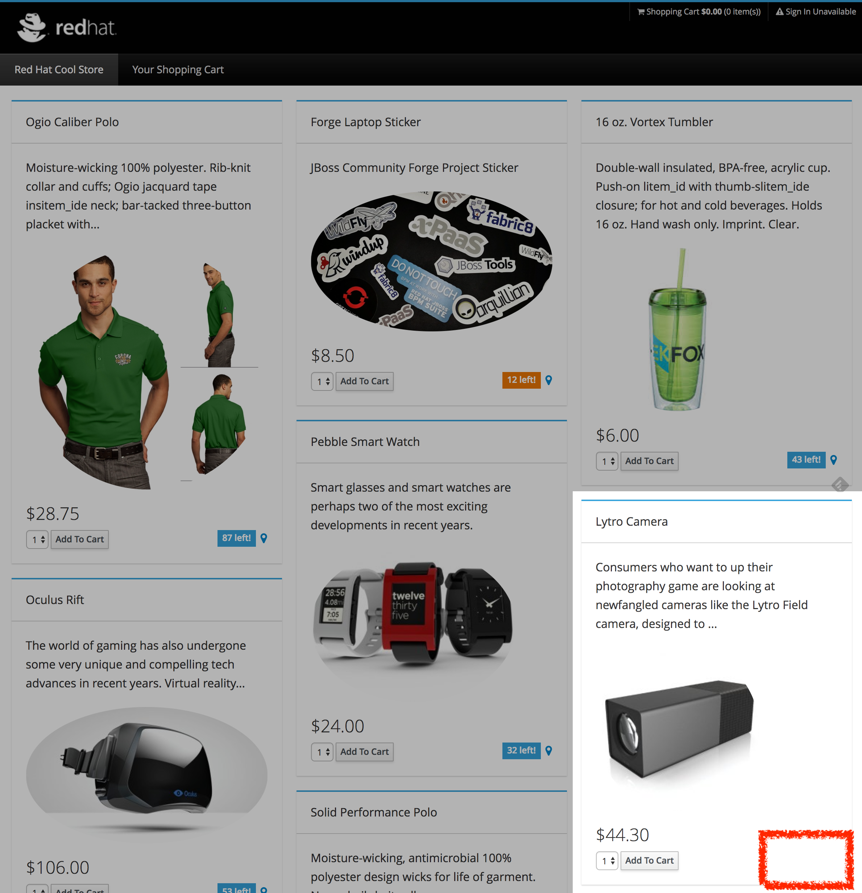
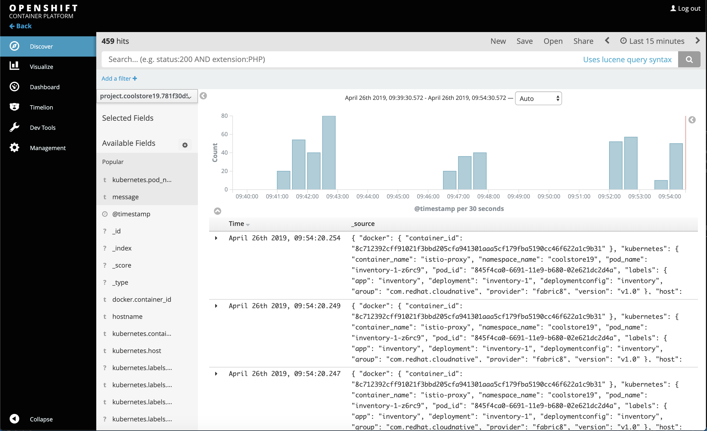
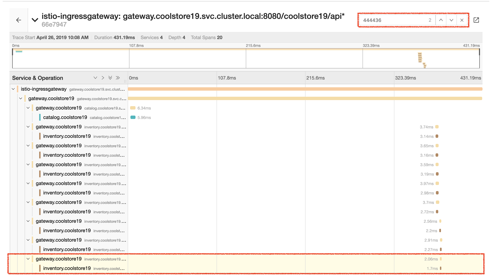
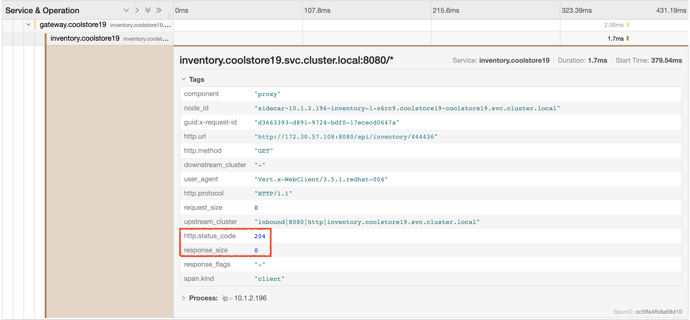
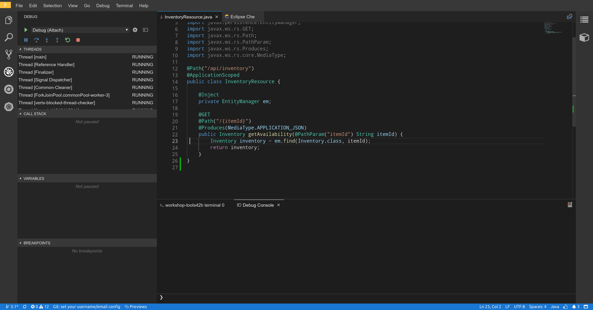
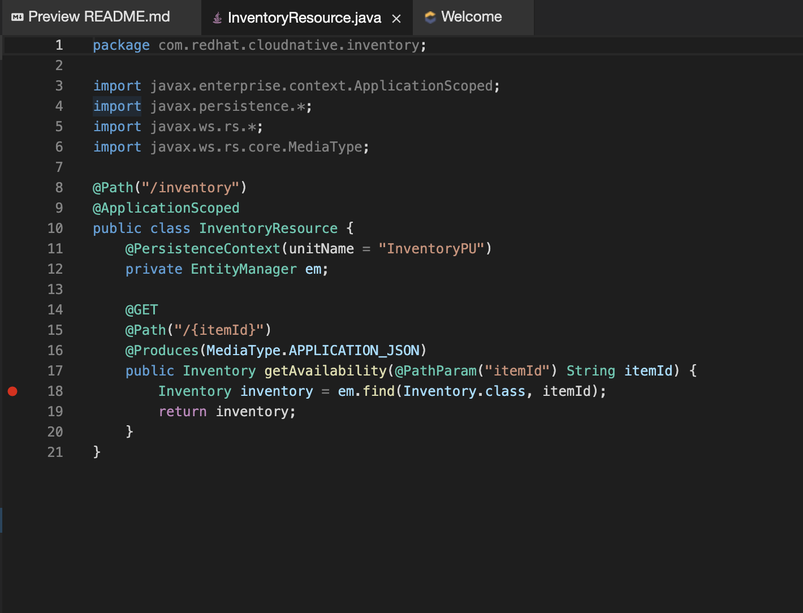
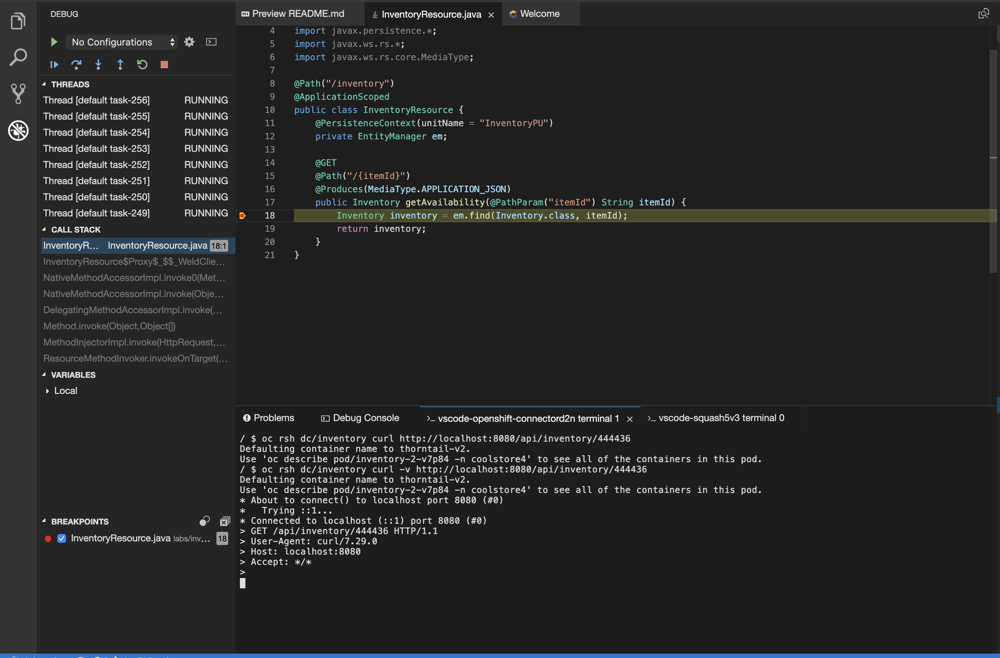
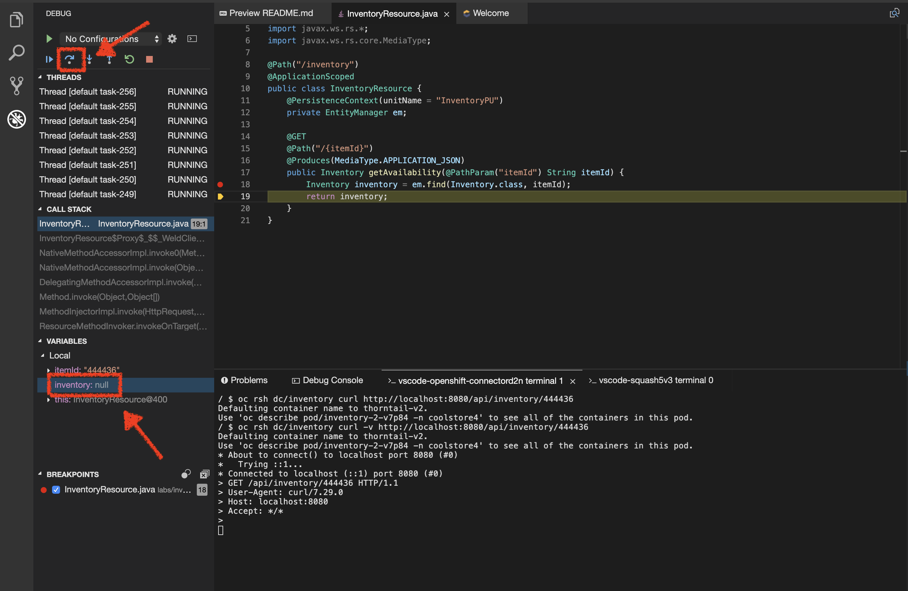
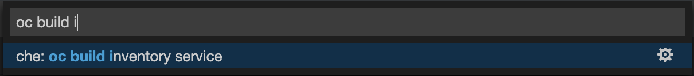

:markup-in-source: verbatim,attributes,quotes
:USER_ID: %USER_ID%
:OPENSHIFT_PASSWORD: %OPENSHIFT_PASSWORD%
:OPENSHIFT_CONSOLE_URL: %OPENSHIFT_CONSOLE_URL%/topology/ns/staging-project{USER_ID}
:KIBANA_URL: %KIBANA_URL%

_20 MINUTES PRACTICE_

After checking logs and traces we need the ability to do live debugging of my application, 
it's an essential piece in the development process. It's time to enter the running system. To penetrate the secured Kubernetes cluster, I need the POWER of Elliot Alderson.

image::images/mrrobot.png[MrRobot, 500]

.MrRobot
https://www.usanetwork.com/mrrobot/photos/eps22init1asec[Source: https://www.usanetwork.com/mrrobot/photos/eps22init1asec^]

'''

=== What is Kibana?

[sidebar]
--

OpenShift provides a logging solution based on ElasticSearch, Fluentd, and https://en.wikipedia.org/wiki/Kibana[Kibana^] :

*  **Fluentd** which serves as both the collector and the normalizer, 
*  **Elasticsearch** serves as the warehouse (aggregation and storage), and 
*  **Kibana** is the visualizer (web UI). **Kibana** is a Node.js application. It works very well with Elasticsearch and is tightly coupled to it. 

image::images/logging-stack.png[Logging Stack, 700]

The logging system can provide two views: 

* **Project logs** - access controlled view to specific project logs for running containers and project resources. Our case in this Workshop. 
* **Ops view** - aggregate logging of all projects across the cluster, in addition to platform logs (nodes, docker, and masters, for example). 

https://docs.openshift.com/container-platform/3.11/install_config/aggregate_logging.html#aggregate-logging-kibana[Additionnal information^]

Log management plays a vital role when we encounter an error in the application. If we do not manage the logs, it will be difficult in any application, especially in microservices architecture, to find the problem and fix it. For our application with lots of microservices we have to identify interesting traces and Kibana is offering an nice User Interface with a search field to explore and to analyze logs files easily. Whenever we get some error in the application(s), we can get the error details and analyze them in a simple way.
--

'''

=== Investigate The Bug

**CoolStore** application seems to have a bug that causes the inventory status for one of the products not to be displayed in the web interface.

This is not an expected behavior!

Let's start our investigation from the application logs!
`*Log in to the {KIBANA_URL}[Kibana Console^] as {OPENSHIFT_USER}/{OPENSHIFT_PASSWORD}*`

After you log in, enter the following configuration:

 * Add the 2 fields: `**kubernetes.pod_name**`, `**message**`
 * Search: `**message:(error)**`

image::images/kibana-search.png[Kibana - Search, 200]

**Push the 'Enter' button**, you will get the following results:

image::images/kibana-error-result.png[Kibana - Error Result, 600]

Oh! Something seems to be wrong with the response the **Gateway Service** has received from the **Inventory Service** for the product id **'444436'**. 
But there doesn't seem to be anything relevant to the **invalid response** error at the **Inventory Service** level! 

`*Go back to 'Distributed Tracing' menu`* from {KIALI_URL}[Kiali Console^]. 
`*Select one of the Distributed Trace then on Search field enter the product id '444436'*`. One span should be highlighted in *light yellow*.

**Expand the 'inventory.{COOLSTORE_PROJECT}' span** in order to get more detail.

No response came back from **Inventory Service** for the product id **'444436'** and that seems to be the reason the inventory status is not displayed 
on the web interface.

Let's debug the **Inventory Service** to get to the bottom of this!

'''

=== Route the traffic on your local workspace

TODO

'''

=== Enable Remote Debugging for Inventory Service Application

Now, you need to switch your application to Remote Debugging Mode. The Java image on OpenShift has built-in support for 
https://access.redhat.com/documentation/en-us/red_hat_jboss_middleware_for_openshift/3/html-single/red_hat_java_s2i_for_openshift/index#example_workflow_remote_debugging_a_java_application_running_on_java_s2i_for_openshift_image[Remote Debugging^] 
and it can be enabled by setting the `**JAVA_DEBUG=true**` environment variable in the deployment config for the pod that you want to remotely debug.

In your link:{CHE_URL}[Workspace^], open a new Terminal with OpenShift tools by clicking
on the `**My Workspace**` white box in the right menu, then `**Plugins -> vscode-openshift-connector -> >_ New terminal**`:

image::images/che-open-openshift-terminal.png[Che - Open OpenShift Terminal, 700]

In the window called `**>_ vscode-openshift-connector terminl**`, execute the following commands:

[source,shell]
.>_ vscode-openshift-connector terminal
----
$ oc set env dc/inventory JAVA_DEBUG=true
$ oc get pods -l app=inventory,deploymentconfig=inventory -w
NAME                           READY     STATUS         RESTARTS   AGE
inventory-1-j4c2g              2/2       Terminating    0          33m
inventory-2-l22lz              2/2       Running        2          1m

<Ctrl+C>
----

The status should be **Running** and there should be **2/2** pods in the **Ready** column. 

'''

=== Debugging with CodeReady Workspaces

TODO

Once done, your Workspace should switch in **Debug Mode** as you can see the screenshot below:

Go back the 'Explorer' view in the left menu and open the `**com.redhat.cloudnative.inventory.InventoryResource**` class
in the `**inventory-quarkus**` project.

**Add a breakpoint** by clicking on the editor sidebar on the line number of the first line of the `**getAvailability()**`
method

In the window called `**>_ vscode-openshift-connector terminal**`, **invoke the Inventory Service API with the
suspect product id** in order to pause the code execution at the defined breakpoint:

[source,shell]
.>_ vscode-openshift-connector terminal
----
$ oc rsh dc/inventory curl -v http://localhost:8080/api/inventory/444436
----

The IDE will automatically switch back to the **Debug Panel** and notice that the code execution is paused at the 
breakpoint on `**InventoryResource**` class.

**Click on the** `**Step Over**` **icon** to execute one line and retrieve the inventory object for the
given product id from the database.

Can you spot the bug now? 

**Look at the Variables window** on the left hand side. The retrieved **inventory** object is `**null**`!

The non-existing product id is not a problem on its own because it simply could mean 
this product is discontinued and removed from the Inventory database but it's not 
removed from the product catalog database yet. The bug is however caused because 
the code returns this **null** value instead of a sensible REST response. If the product 
id does not exist, a proper JSON response stating a zero inventory should be 
returned instead of **null**.

**Click on the** _Resume_ **icon** to continue the code execution and then `*on the _Stop_ icon*` to
end the debug session.

'''

=== Fix the Bug

Under the `**/projects/inventory-quarkus**` project, **update the** `**getAvailability()**` **method** of the `**InventoryResource**` class
 as following:

[source,java]
.InventoryResource.java
----
@GET
@Path("/api/inventory/{itemId}")
@Produces(MediaType.APPLICATION_JSON)
public Inventory getAvailability(@PathParam("itemId") String itemId) {
    Inventory inventory = em.find(Inventory.class, itemId);

    if (inventory == null) {
        inventory = new Inventory();
        inventory.setItemId(itemId);
        inventory.setQuantity(0);
    }

    return inventory;
}
----

In your link:{CHE_URL}[Workspace^], via the command menu (Cmd+Shift+P ⌘⇧P on macOS or Ctrl+Shift+P ⌃⇧P on Windows and Linux),

**run** `**Task: Run Task... ->  che: oc build inventory service**`

image::images/che-runtask.png[Che - RunTask, 500]

When the container is rebuilt and deployed, point your browser at the Web route and verify 
that the inventory status is visible for all products. The suspicious product should show
the inventory status as **Not in Stock**.

image::images/debug-coolstore-bug-fixed.png[Inventory Status Bug Fixed, 800]

'''

=== CONGRATULATIONS!!!

Well done and congratulations for completing all the labs.
