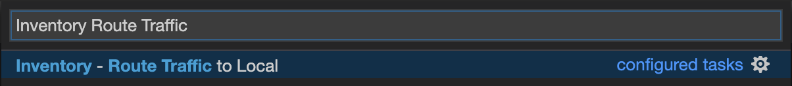
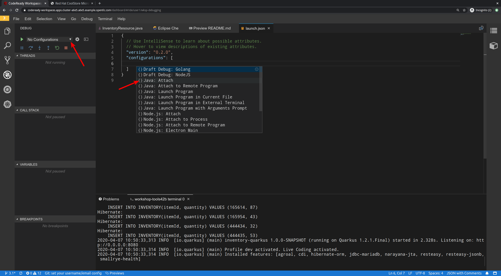
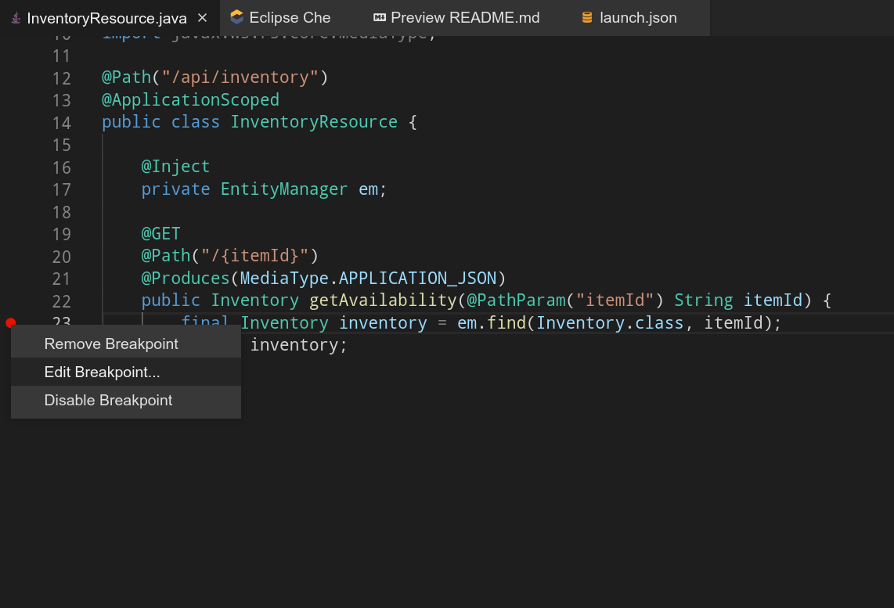
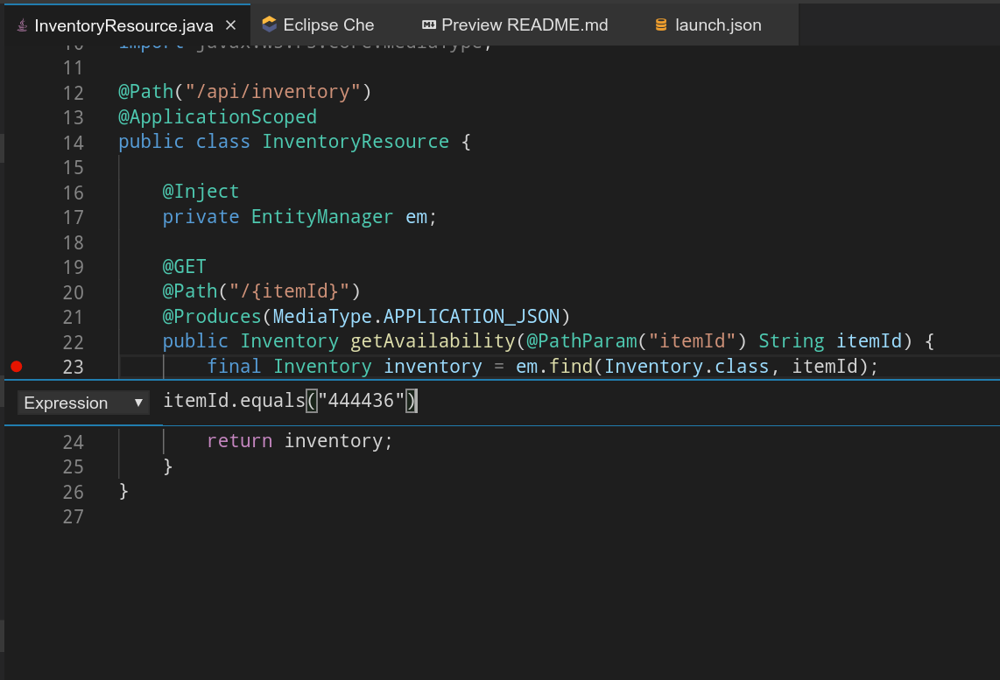
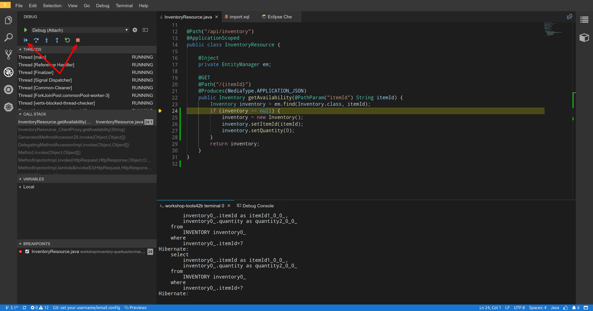

:markup-in-source: verbatim,attributes,quotes
:USER_ID: %USER_ID%
:OPENSHIFT_PASSWORD: %OPENSHIFT_PASSWORD%
:OPENSHIFT_CONSOLE_URL: %OPENSHIFT_CONSOLE_URL%/topology/ns/staging-project{USER_ID}
:KIBANA_URL: %KIBANA_URL%
:APPS_HOSTNAME_SUFFIX: %APPS_HOSTNAME_SUFFIX%
:COOLSTORE_HOMEPAGE: http://web-staging-project{USER_ID}.{APPS_HOSTNAME_SUFFIX}

_20 MINUTES PRACTICE_

After checking logs and traces we need the ability to do live debugging of my application,
it's an essential piece in the development process. It's time to enter the running system. To penetrate the secured Kubernetes cluster, I need the POWER of Elliot Alderson.

.Mr. Robot. Sam Esmail (	NBCUniversal Television Distribution)
[caption=" "]
image::images/mrrobot.png[MrRobot, 500]

'''

=== What is Kibana?

[sidebar]
--
image::images/Kibana-Logo-Color-H.png[Kibana, 400]

OpenShift provides a logging solution based on ElasticSearch, Fluentd, and https://en.wikipedia.org/wiki/Kibana[Kibana^] :

*  **Fluentd** which serves as both the collector and the normalizer, 
*  **Elasticsearch** serves as the warehouse (aggregation and storage), and 
*  **Kibana** is the visualizer (web UI). **Kibana** is a Node.js application. It works very well with Elasticsearch and is tightly coupled to it. 

image::images/logging-stack.png[Logging Stack, 700]

The logging system can provide two views: 

* **Project logs** - access controlled view to specific project logs for running containers and project resources. Our case in this Workshop. 
* **Ops view** - aggregate logging of all projects across the cluster, in addition to platform logs (nodes, docker, and masters, for example). 

https://docs.openshift.com/container-platform/3.11/install_config/aggregate_logging.html#aggregate-logging-kibana[Additional information^]

Log management plays a vital role when we encounter an error in the application. If we do not manage the logs, it will be difficult in any application, especially in microservices architecture, to find the problem and fix it. For our application with lots of microservices we have to identify interesting traces and Kibana is offering
nice User Interface with a search field to explore and to analyze logs files easily. Whenever we get some error in the application(s), we can get the error details and analyze them in a simple way.
--

'''

=== Investigate The Bug

**CoolStore** application seems to have a bug that causes the inventory status for one of the products not to be displayed on the page.

image::images/debug-coolstore-bug.png[Inventory Status Bug, 800]

This is not an expected behavior!

Let's start our investigation from the application logs!
**Log in to the** link:{KIBANA_URL}[Kibana Console^] as `**user{USER_ID}/{OPENSHIFT_PASSWORD}**`

image::images/kibana-console.png[Kibana - Console, 600]

After you log in, enter the following configuration:

 * Add the 2 fields: `**kubernetes.pod_name**`, `**message**`
 * Search: `**message:(error)**`

image::images/kibana-search.png[Kibana - Search, 200]

**Push the 'Enter' button**, you will get the following results:

image::images/kibana-error-result.png[Kibana - Error Result, 600]

Oh! Something seems to be wrong with the response the **Gateway Service** has received from the **Inventory Service** for the product id **'444436'**. 
But there doesn't seem to be anything relevant to the **invalid response** error at the **Inventory Service** level! 

**Go back to** `Distributed Tracing` **menu** from link:{KIALI_URL}[Kiali Console^].
**Select one of the** `Distributed Trace` **then on** `Search` **field enter the product id** `444436`.
One span should be highlighted in *light yellow*.

image::images/jaeger-trace-inventory.png[Jaeger - Trace Inventory , 600]

**Expand the** `inventory.{COOLSTORE_PROJECT}` **span** in order to get more detail.

image::images/jaeger-trace-inventory-details.png[Jaeger - Trace Inventory , 800]

No response came back from `**Inventory Service**` for the product id `**444436**` and that seems to be the reason the inventory status is not displayed.

Let's debug the `**Inventory Service**` to get to the bottom of this!

'''

=== Debugging with CodeReady Workspaces and Istio Workspace

Similarly to previous lab, we will leverage **Istio Workspace** tool to start **Inventory Service**, connect to actual production cluster and debug the code.

First, we have to start Quarkus-based `Inventory Service` in the `dev` mode. This is achieved by `quarkus:dev` Maven goal.
This will allow us to:

. attach the debugger to running service.
. reload code without restarts.

We will also set header to `lab4`, so we can reach our instance and debug it where all the other users will still rely on the production instance.

IMPORTANT: Having debugger attached to the production instance will result in halting the whole system for every user. We definitely don't want this to happen. That's why `Istio Workspace` was born.

In your link:{CHE_URL}[Workspace^], `**click on 'Terminal' -> 'Run Task...'**`

image::images/che-runtask.png[Che - RunTask, 500]

Then `**select the command 'Inventory - Route Traffic to local'**`

Next, we have to configure remote debugging session. By default, Quarkus starts the remote debugger on port `5005`, so let's attach debugger to it.

Alternatively you can simply paste JSON below to `.theia/launch.json`

[source,json]
.launch.json
----
{
  "version": "0.2.0",
  "configurations": [
      {
          "type": "java",
          "name": "Debug (Attach)",
          "request": "attach",
          "hostName": "localhost",
          "port": 5005
      }
  ]
}
----

Once done, your can start debugging from the **Debug Mode** as you can see the screenshot below:

image::images/che-debugmode.png[Che - Debug Mode, 700]

Go back the `**Explorer**` view in the left menu and open the `**com.redhat.cloudnative.inventory.InventoryResource**` class
in the `**inventory-quarkus**` project.

**Add a breakpoint** by clicking on the editor sidebar on the line number of the first line of the `**getAvailability()**`
method.

image::images/che-breakpoint.png[Che - Breakpoint, 700]

Additionally, we can narrow breakpoint capture by enabling a condition `itemId.equals("444436")`.

Right-click on the breakpoint and select `**Edit Breakpoint...**` option.

Then add expression mentioned above - `itemId.equals("444436")` and hit `ENTER`.

We can now access Cool Store app with the new route link:{COOLSTORE_HOMEPAGE}/#!/?route=lab4[] to see if we can reach the breakpoint.

The IDE will automatically switch back to the **Debug Panel** and notice that the code execution is paused at the
breakpoint on `**InventoryResource**` class.

image::images/che-breakpointstop.png[Che - Breakpoint Stop, 900]

**Click on the** `**Step Over**` **icon** to execute one line and retrieve the inventory object for the
given product id from the database.

image::images/che-stepover.png[Che - Step Over, 900]

Can you spot the bug now? 

**Look at the Variables window** on the left-hand side. The retrieved **inventory** object is `**null**`!

The non-existing product id is not a problem on its own. It simply could mean this product is discontinued and removed
from the Inventory database, but it's not removed from the product catalog database yet.
However, the bug occurs because the code returns **null** value instead of a sensible REST response.
If the product id does not exist, a proper JSON response stating a zero inventory should be  returned instead of **null**.

**Click on the** _Resume_ **icon** to continue the code execution and then **on the** _Stop_ **icon** to
end the debugging session.

'''

=== Fix the Bug

Under the `**inventory-quarkus**` project, **update the** `**getAvailability()**` **method** of the `**InventoryResource**` class
 as follows:

[source,java]
.InventoryResource.java
----
@GET
@Path("/{itemId}")
@Produces(MediaType.APPLICATION_JSON)
public Inventory getAvailability(@PathParam("itemId") String itemId) {
    Inventory inventory = em.find(Inventory.class, itemId);

    if (inventory == null) {
        inventory = new Inventory();
        inventory.setItemId(itemId);
        inventory.setQuantity(0);
    }

    return inventory;
}
----

After changing this logic, lets access link:{COOLSTORE_HOMEPAGE}/#!/?route=lab4[] to verify how it works now.

image::images/debug-coolstore-bug-fixed.png[Inventory Status Bug Fixed, 800]

If it looks ok we are ready to roll it out to production!

You can now stop `ike` tool in the terminal by pressing Ctrl+C. This will result in undeploying our special instance which we just used for debugging purposes.

'''

=== CONGRATULATIONS!!!

Well done and congratulations for completing all the labs.
