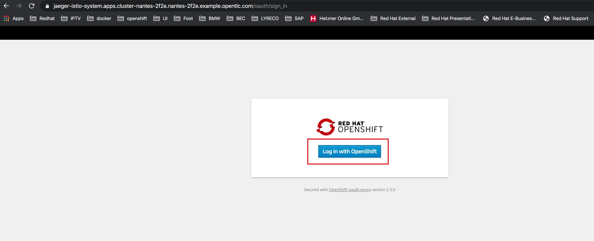
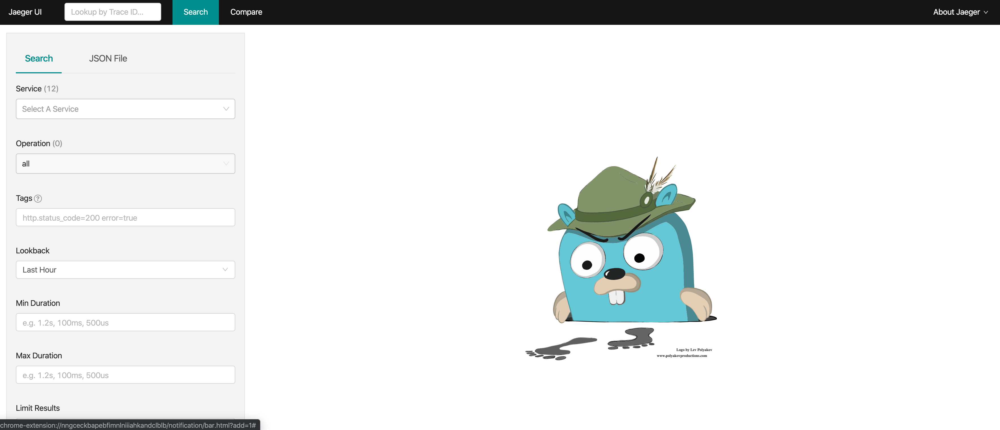
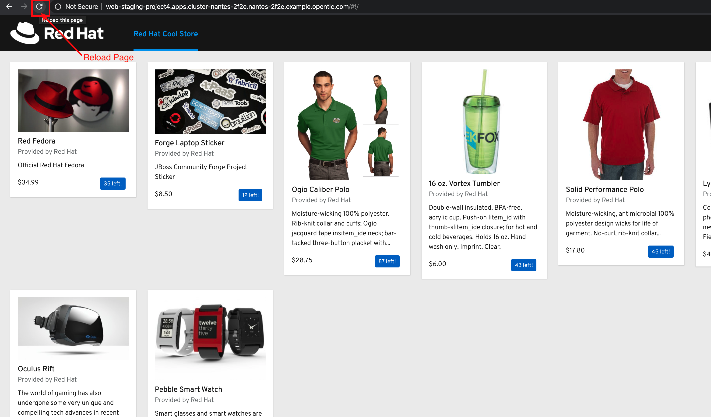
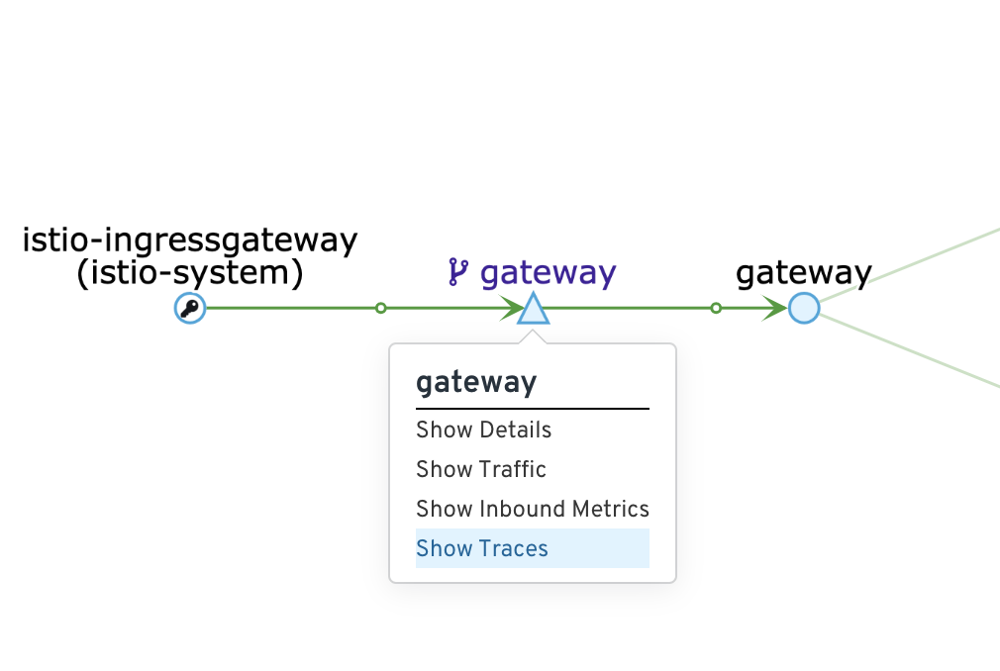
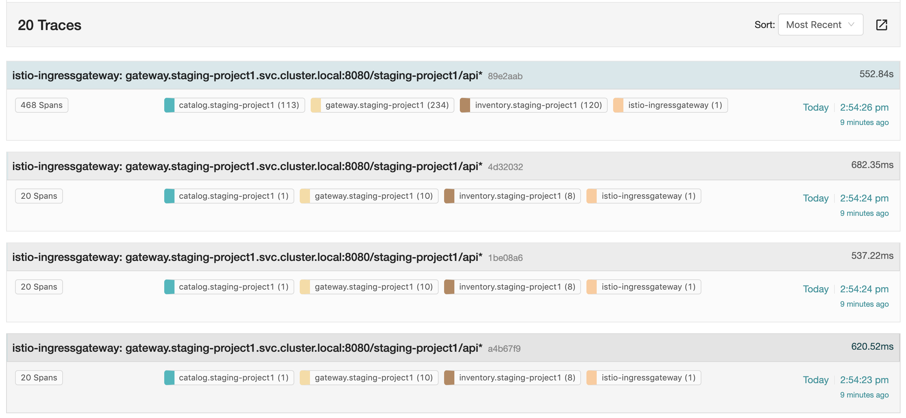
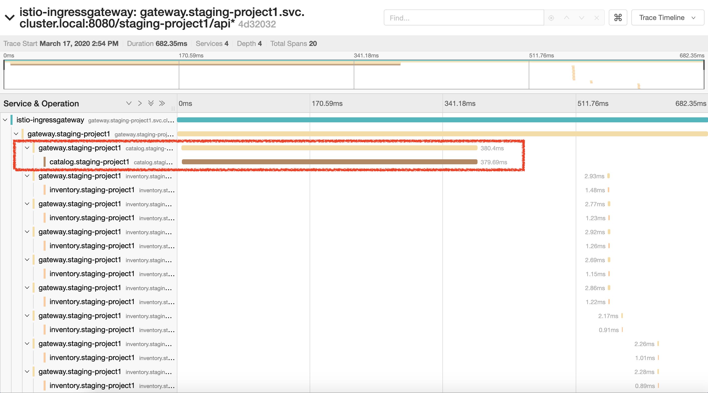
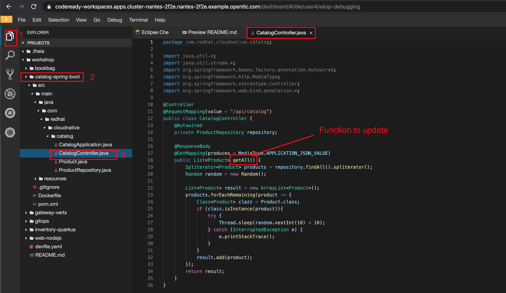
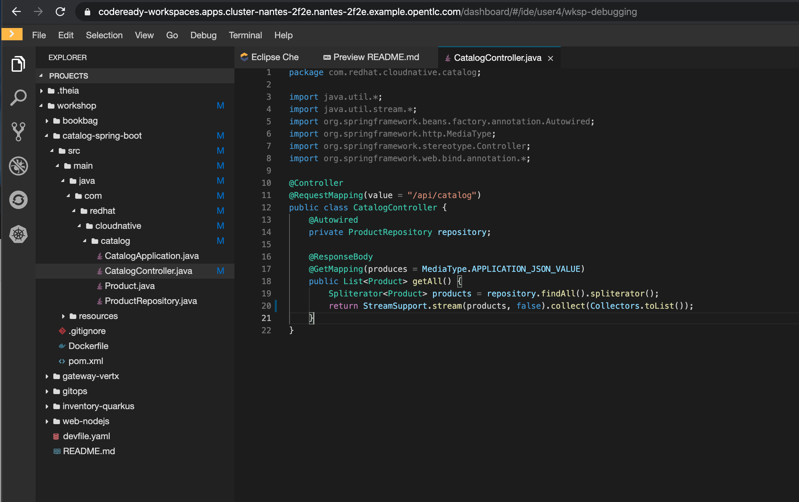
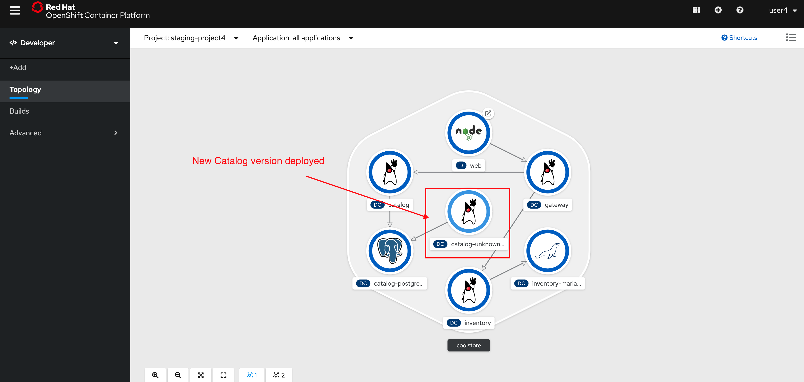

:markup-in-source: verbatim,attributes,quotes
:USER_ID: %USER_ID%
:OPENSHIFT_PASSWORD: %OPENSHIFT_PASSWORD%
:OPENSHIFT_CONSOLE_URL: %OPENSHIFT_CONSOLE_URL%/topology/ns/staging-project{USER_ID}
:JAEGER_URL: %JAEGER_URL%
:KIALI_URL: %KIALI_URL%
:APPS_HOSTNAME_SUFFIX: %APPS_HOSTNAME_SUFFIX%
:COOLSTORE_HOMEPAGE: web-staging-project{USER_ID}.{APPS_HOSTNAME_SUFFIX}

_20 MINUTES PRACTICE_

As Cobb and Arthur in *Inception*, let's perform a *"Trace Within a Trace" Strategy* called **Distributed Tracing** 
using Red Hat OpenShift Container Platform to infiltrate the application traces and extract valuable information to solve 
the issues.

image::images/inception.jpg[Inception, 500]

[.text-center]
https://wallpapercave.com/wp/ZDpGHyX.jpg[Source: https://wallpapercave.com/wp/ZDpGHyX.jpg^]

As Cobb and Arthur in *Inception*, let's perform a *"Trace Within a Trace" Strategy* called **Distributed Tracing** using Red Hat OpenShift Container Platform to infiltrate the application traces and extract valuable information to solve the issues

'''

=== What is Jaeger?

[sidebar]
--
image::images/jaeger-logo.png[Jaeger, 400]

https://www.jaegertracing.io[Jaeger Tracing^], inspired by Dapper and OpenZipkin, is a distributed tracing system released as open source by Uber Technologies. It is used for monitoring and troubleshooting microservices-based distributed systems, including:

* Distributed context propagation
* Distributed transaction monitoring
* Root cause analysis
* Service dependency analysis
* Performance / latency optimization

https://www.kiali.io[Kiali^] includes https://www.jaegertracing.io[Jaeger Tracing^] to provide distributed tracing out of the box.
--

'''

=== Connect to Jaeger First.

Because of security reasons, you need first to access the main {JAEGER_URL}[Jaeger Console^] 
and log in as user{USER_ID}/{OPENSHIFT_PASSWORD}

Once connected you will see a page like this one:

Now through Kiali you will be able to access to the **Tracing** part. 

Now you have to go to your Application {COOLSTORE_HOMEPAGE}[Coolstore^] HomePage to generate some loads and traffic. Just **reload** it multiple times and you can go to Kiali Console

[.text-center]
{COOLSTORE_HOMEPAGE}[Coolstore Application Homepage^]

=== What are you hidding, Mr/Mrs *Application*?

From the {KIALI_URL}[Kiali Console^], on the **'Graph' view**, 
`*right-click on 'gateway Virtual Service' > 'Show Traces'*`

Now you can see the *distributed traces* of our applications.

**Distributed Tracing** involves propagating the tracing context from service to service by sending certain incoming 
HTTP headers downstream to outbound requests. To do this, services need some hints to tie together the entire trace. 
They need to propagate the appropriate HTTP headers so that when the proxies send span information, the spans can be 
correlated correctly into a single trace.

*We are going to only focus on distributed traces with 20 spans.*

On the right hand side, you have information like the duration.
One request takes **more than 500ms** which you could judge as *normal* but ...

`*Let’s click on a trace title bar.*`

Interesting... The major part of a call is consuming by the **Catalog Service**.
So let's have a look on its code. 
`*Go through the 'catalog-spring-boot' project and find the following piece of code*`:

[source,java]
.CatalogController.java
----
@ResponseBody
@GetMapping(produces = MediaType.APPLICATION_JSON_VALUE)
public List<Product> getAll() {
    Spliterator<Product> products = repository.findAll().spliterator();
    Random random = new Random();

    List<Product> result = new ArrayList<Product>();
    products.forEachRemaining(product -> {
        Class<Product> clazz = Product.class;
        if (clazz.isInstance(product)){
            try {
                Thread.sleep(random.nextInt(10) * 10);
            } catch (InterruptedException e) {
                e.printStackTrace();
            }
        }
        result.add(product);
    });
    return result;
}
----

And yes, this burns your eyes, right?! Basically nobody could understand what the developer attempted to achieve but we do not have the time for that.
This piece of code is a part of the **getAll()** method which returns the list of all products from the database. 
As you are an expert of Java 8, you are about to create a masterpiece by both simplifying the code and increasing performance. 

`*Replace the content of the 'getAll()' method*` as following:

[source,java]
.CatalogController.java
----
    @ResponseBody
    @GetMapping(produces = MediaType.APPLICATION_JSON_VALUE)
    public List<Product> getAll() {
        Spliterator<Product> products = repository.findAll().spliterator();
        return StreamSupport.stream(products, false).collect(Collectors.toList());
    }
----

[IMPORTANT]
====
Do not forget to import the missing packages.
====

Now let's test the new version of the source code.
To do it we will use a new Project framework called Istio Workspace.

'''

=== What is Istio Workspace?

[sidebar]
--
image::images/istio-workspaces-logo.png[Istio Workspace, 400]

https://github.com/Maistra/istio-workspace[Istio Workspace^] : 
Safely develop and test on any kubernetes cluster without distracting others.

* Do you have confidence that your Test and Stage environments reflect reality? 
* Are they easy to keep up-to-date with production? 
* Can you reproduce production failure in these environments or locally? 
* What about that error you keep seeing on production that’s never occurring on Test or Stage?

It’s been always hard to test new functionality before it reaches production. Even more so, with the shift from a **monolith** to **microservices** and increasing scale. 
Can you still spin up the entire solution on your laptop to debug and test a suspicious piece of code? Testing on production is no longer a meme. It’s reality and a necessity.

This project works with Istio and Kubernetes or Openshift to give you confidence that your changes won’t blow up production cluster and your users won’t even notice a glitch.

TODO

--

'''

=== Route the traffic on your local workspace

[source,shell,subs="{markup-in-source}"]
.>_ workshop-tools terminal

$ ike develop --deployment catalog --run "mvn spring-boot:run"

TODO

'''

=== Test the new traffic

TODO

Just wonderful! You reduce the response time by a factor of 5!! You should be proud!!

'''

=== CONGRATULATIONS!!!

You make it but **is the spinning top stopped or not at the end?**

[.text-center]
https://wallpapercave.com/wp/plK5eJm.jpg[Source: https://wallpapercave.com/wp/plK5eJm.jpg^]

We will never know and now, it is time to go deeper again!!
