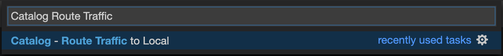
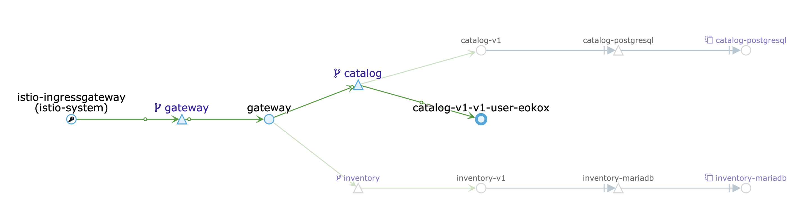
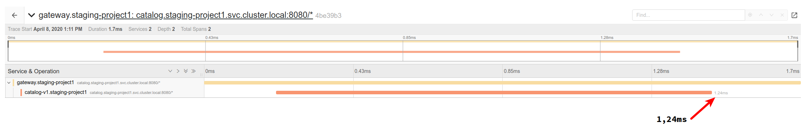

:markup-in-source: verbatim,attributes,quotes
:USER_ID: %USER_ID%
:OPENSHIFT_PASSWORD: %OPENSHIFT_PASSWORD%
:OPENSHIFT_CONSOLE_URL: %OPENSHIFT_CONSOLE_URL%/topology/ns/staging-project{USER_ID}
:JAEGER_URL: %JAEGER_URL%
:KIALI_URL: %KIALI_URL%
:APPS_HOSTNAME_SUFFIX: %APPS_HOSTNAME_SUFFIX%
:COOLSTORE_HOMEPAGE: http://web-staging-project{USER_ID}.{APPS_HOSTNAME_SUFFIX}

_20 MINUTES PRACTICE_

As Cobb and Arthur in *Inception*, let's perform a *"Trace Within a Trace" Strategy* called **Distributed Tracing** 
using Red Hat OpenShift Container Platform to infiltrate the application traces and extract valuable information to solve 
the issues.

.Inception. Christopher Nolan (Warner Bros. Pictures)
[caption=" "]
image::images/inception.jpg[Inception, 500]

'''

=== What is Jaeger?

[sidebar]
--
image::images/jaeger-logo.png[Jaeger, 400]

https://www.jaegertracing.io[Jaeger Tracing^], inspired by Dapper and OpenZipkin, is a distributed tracing system released as open source by Uber Technologies. It is used for monitoring and troubleshooting microservices-based distributed systems, including:

* Distributed context propagation
* Distributed transaction monitoring
* Root cause analysis
* Service dependency analysis
* Performance / latency optimization

https://www.kiali.io[Kiali^] includes https://www.jaegertracing.io[Jaeger Tracing^] to provide distributed tracing out of the box.
--

'''

=== Connect to Jaeger First.

Because of security reasons, you need first to access the main link:{JAEGER_URL}[Jaeger Console^]
and log in as `user{USER_ID}/{OPENSHIFT_PASSWORD}`

image::images/jaeger-loginpage.png[Jaeger - Login Page, 800]

Once connected you will see a page like this one:

image::images/jaeger-ui.png[Jaeger - UI, 800]

Now through Kiali you will be able to access to the **Tracing** part.

You have to go to your Application link:{COOLSTORE_HOMEPAGE}[Coolstore^] HomePage to generate some loads and traffic. Just **reload** it multiple times and you can go to Kiali Console

image::images/coolstore-homepage.png[Coolstore Home page, 800]
[.text-center]
{COOLSTORE_HOMEPAGE}[Coolstore Application Homepage^]

=== What are you hiding, Mr/Mrs *Application*?

From link:{KIALI_URL}[Kiali^], in the **'Graph' view**, 
`*right-click on 'gateway Virtual Service' > 'Show Traces'*`

image::images/kiali-show-traces.png[Kiali - Show Traces, 800]

Now you can see the *distributed traces* of our applications.

**Distributed Tracing** involves propagating the tracing context from service to service by sending certain incoming 
HTTP headers downstream to outbound requests. To do this, services need some hints to tie together the entire trace. 
They need to propagate the appropriate HTTP headers so that when the proxies send span information, the spans can be 
correlated correctly into a single trace.

image::images/jaeger-trace-delay-view.png[Jaeger - Trace Delay View, 700]

*We are going to only focus on distributed traces with 20 spans.*

On the right-hand side, you have information like the duration.
One request takes **more than 500ms** which you could judge as *normal* but ...

`*Let’s click on a trace title bar.*`

image::images/jaeger-trace-delay-detail-view.png[Jaeger - Trace Delay Detail View, 700]

Interesting... The major part of a call is consuming by the **Catalog Service**.
So let's have a look on its code. 
`*Go through the 'catalog-spring-boot' project and find the following piece of code*`:

image::images/catalog-controller.png[Catalog Controller - Java code, 700]

[source,java]
.CatalogController.java
----
@ResponseBody
@GetMapping(produces = MediaType.APPLICATION_JSON_VALUE)
public List<Product> getAll() {
    Spliterator<Product> products = repository.findAll().spliterator();
    Random random = new Random();

    List<Product> result = new ArrayList<Product>();
    products.forEachRemaining(product -> {
        Class<Product> clazz = Product.class;
        if (clazz.isInstance(product)){
            try {
                Thread.sleep(random.nextInt(10) * 10);
            } catch (InterruptedException e) {
                e.printStackTrace();
            }
        }
        result.add(product);
    });
    return result;
}
----

And yes, this burns your eyes, right?! Basically nobody could understand what the developer attempted to achieve, but we do not have the time for that.
This piece of code is a part of the `**getAll()**` method which returns the list of all products from the database.
As you are a Java expert, you are about to create a masterpiece by both simplifying the code and increasing performance.

Let's fix it! To do it we will use a new tool called https://github.com/Maistra/istio-workspace[Istio Workspace].

'''

=== What is Istio Workspace?

[sidebar]
--

https://github.com/Maistra/istio-workspace[Istio Workspace^] is a tool that let you safely develop and test on any kubernetes cluster without distracting others.

The key value proposition is to allow you run service you are working on locally but interact with the other services running in the cluster.

This way you can use your favourite tools and avoid making your machine sweating from trying to run "the whole cloud" where your application is deployed.

Additionally, you can develop and test your changes without interfering with other users. Only you would be able to see your changes before they hit the production.

* Do you have confidence that your Test and Stage environments reflect reality? 
* Are they easy to keep up-to-date with production? 
* Can you reproduce production failure in these environments or locally? 
* What about that error you keep seeing on production that’s never occurring on Test or Stage?

It has been always hard to test new functionality before it reaches production. Even more so, with the shift from a **monolith** to **microservices** and increasing scale.
It is practically impossible to spin up the entire solution on your laptop to debug and test a suspicious piece of code. Testing on production is no longer a meme. It’s reality and a necessity.

This project works with Istio and Kubernetes or Openshift to give you confidence that your changes won’t blow up production cluster and your users won’t even notice a glitch.

--

'''

=== Route the traffic on your local workspace

First we have to fix the problem. **Replace the content of the** `**getAll()**` **method** as following:

[source,java]
.CatalogController.java
----
@ResponseBody
@GetMapping(produces = MediaType.APPLICATION_JSON_VALUE)
public List<Product> getAll() {
    System.out.println(">>>> getAll, but faster");
    Spliterator<Product> products = repository.findAll().spliterator();
    return StreamSupport.stream(products, false).collect(Collectors.toList());
}
----
image::images/catalog-controller-updated.png[Catalog Controller Updated- Java code, 700]

With those changes in place we can now test it. But does it mean we have to go through the whole `**build -> deploy -> test**` cycle? That can take a couple of minutes.
Luckily, with Istio Workspace we can now start service with our changes locally, but in a way like it would be running as part of the application.

In your link:{CHE_URL}[Workspace^], `**click on 'Terminal' -> 'Run Task...'**`

image::images/che-runtask.png[Che - RunTask, 500]

Then `**select the command 'Catalog - Route Traffic to local'**`

This command will deploy a new version of the service which you can access by using special routing header `**ike-session-id=lab3**`.

image::images/new-catalog-service.png[New Catalog Deployed, 700]

'''

=== Test the new version

As we have our improved service already up and running, it's time to test the new version.
You can now access application through web interface by adding `**/?route=lab3**` query parameter 
to the URL of deployed app:

link:{COOLSTORE_HOMEPAGE}/#!/?route=lab3[]

NOTE: `**route=lab3**` is not automatically added by Istio Workspace.
This parameter, like any other should be handled (and appropriately propagated) by the application itself.

From link:{KIALI_URL}[Kiali^], in the **'Graph' view**, `**check the new traffic**`

The traffic is directed to the new version of the Catalog service, but will keep all the other users still relying on the last deployed version.
Sadly, they will be still affected by the performance regression we just fixed.

We can also see directly in the console of your link:{CHE_URL}[Workspace^], that our service has been accessed, as we are printing a test message every single time `**CatalogController**` is accessed now.

image::images/ike-develop-catalog-hit.png[Accessing new version of Catalog Service in Che, 700]

Moreover, we can see improvements in the response time as well:

Just wonderful! You reduced the response time by a factor of 5! You should be proud!

'''

=== CONGRATULATIONS!!!

You make it but **is the spinning top stopped or not at the end?**

.Inception. Christopher Nolan (Warner Bros. Pictures)
[caption=" "]
image::images/spinningtop.jpg[Inception - Spinning Top, 500]

We will never know and now, it is time to go deeper again!!
