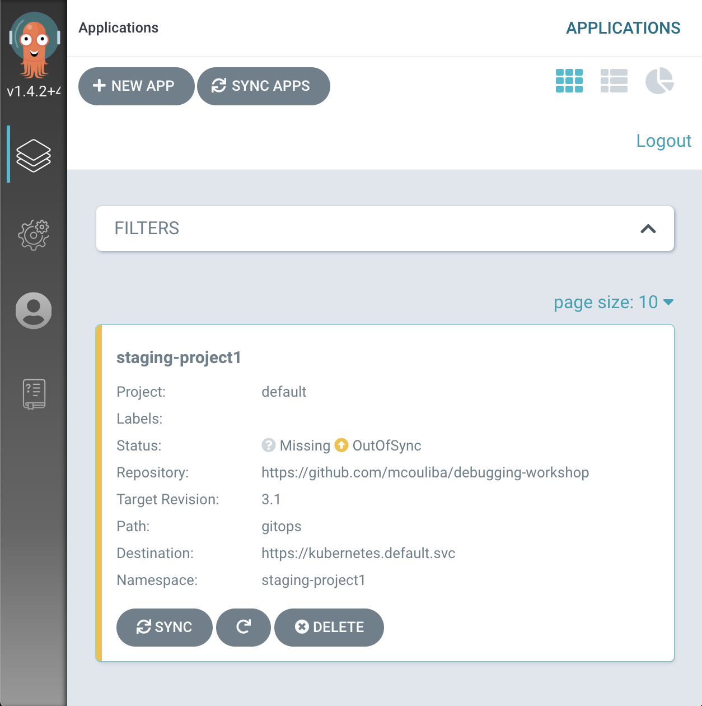
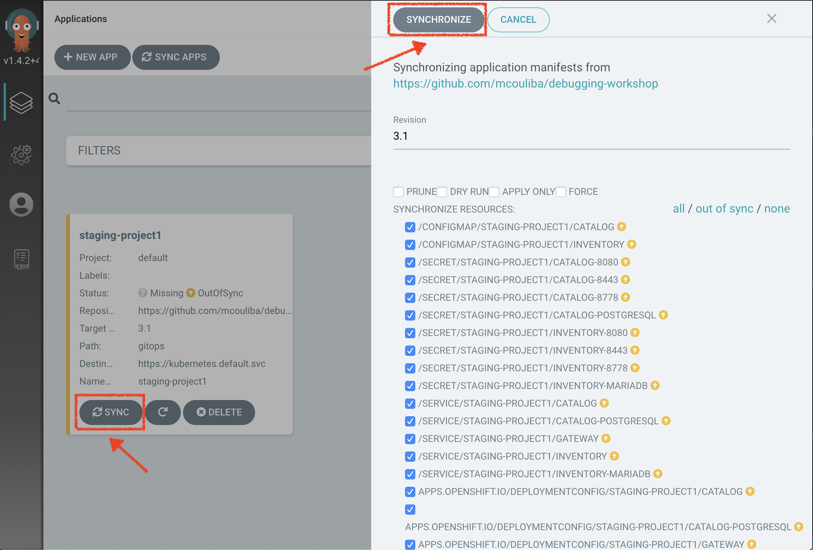
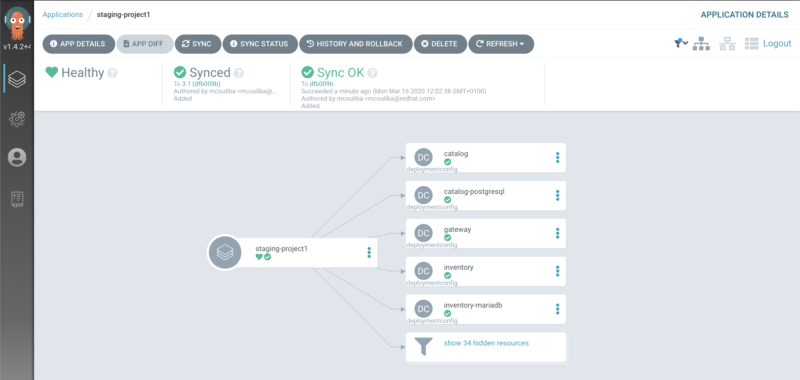
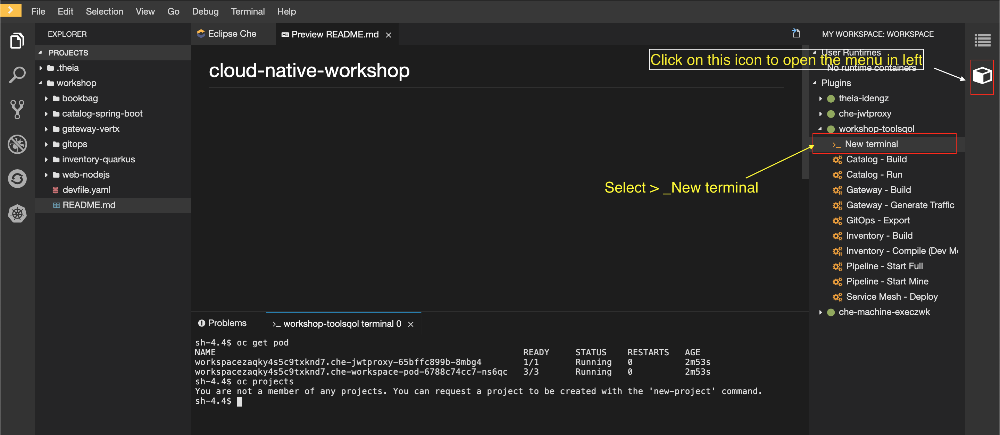
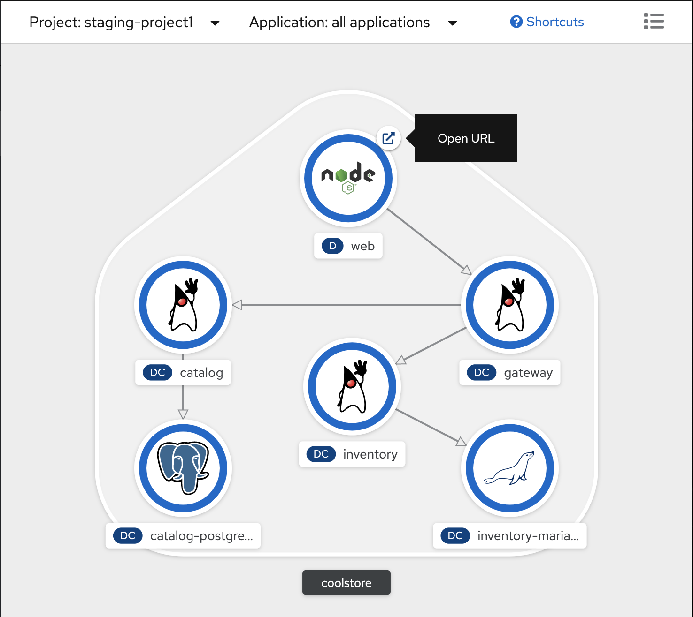
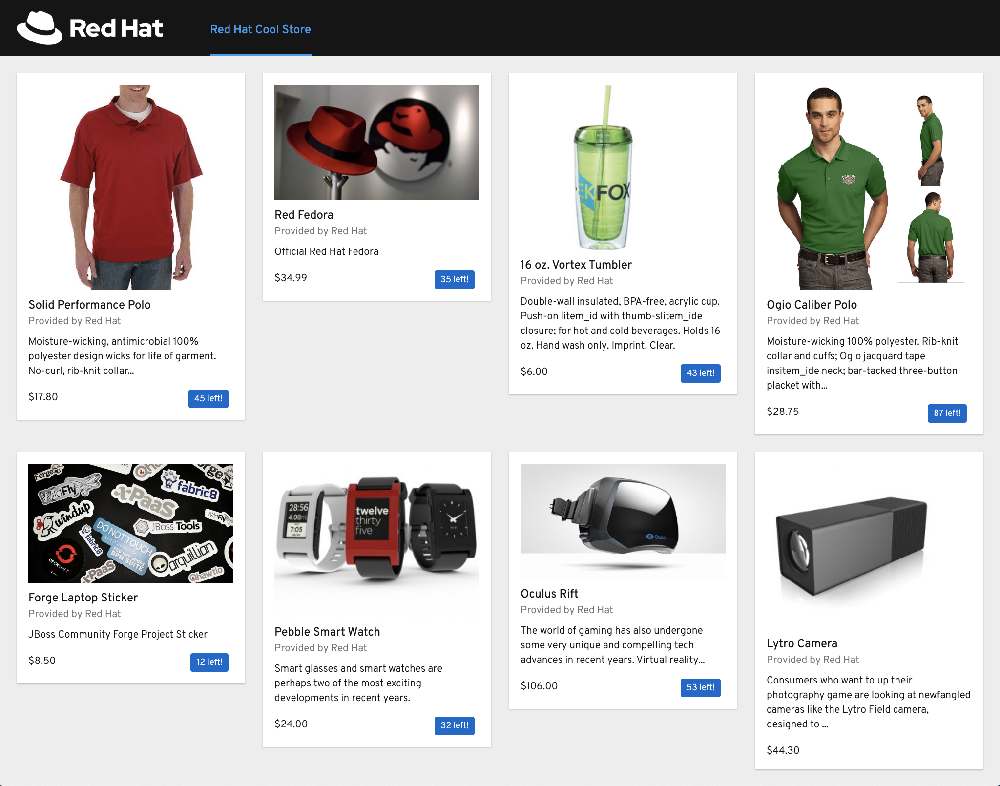

:markup-in-source: verbatim,attributes,quotes
:USER_ID: %USER_ID%
:OPENSHIFT_PASSWORD: %OPENSHIFT_PASSWORD%
:OPENSHIFT_CONSOLE_URL: %OPENSHIFT_CONSOLE_URL%/topology/ns/staging-project{USER_ID}
:GITOPS_URL: %GITOPS_URL%

_15 MINUTES PRACTICE_
<<<<<<< HEAD

In this serie if their body dies, their stack can be stored indefinitely. 
Their stacks can be downloaded into new bodies, or "sleeves", after death. Using **Argo CD**, GitOps continuous 
delivery tool for Kubernetes you will be able to restart the Stacks of the **Mysterious Apps**
=======
>>>>>>> c55c3e09cc297d4304aea4ca7f9fb36076da7d58

.Altered Carbon (Netflix)
[caption=" "]
[window=_blank, align="center"]

In this serie if their body dies, their stack can be stored indefinitely. Their stacks can be downloaded into new bodies, or "sleeves", after death. Using **Argo CD**, GitOps continuous delivery tool for Kubernetes you will be able to restart the Stacks of the **Mysterious Apps**

'''

=== What is Argo CD?

[sidebar]
--
[window=_blank, align="center"]
image::images/argocd-logo.png[Argo CD Logo, 200]

https://argoproj.github.io/argo-cd/[Argo CD^] is a declarative, GitOps continuous delivery tool for Kubernetes.

It follows the GitOps pattern of using Git repositories as the source of truth for defining 
the desired application state. 

It automates the deployment of the desired application states in the specified target environments. Application 
deployments can track updates to branches, tags, or pinned to a specific version of manifests at a Git commit.
--

'''

=== Log in to Argo CD

`*Click on the below button called 'Developer GitOps'*`

[link={GITOPS_URL}]
[window=_blank, align="center"]
image::images/developer-gitops-button.png[Developer GitOps - Button, 300]

Then `*login as user{USER_ID}/{OPENSHIFT_PASSWORD}*`, `*click on 'Allow selected permissions'*`

[window=_blank, align="center"]
image::images/argocd-loginpage.png[Argo CD - Login Page, 500]

Once completed, you will be redirected to the following page.

'''
=== Sync/Deploy The GitOps Application

Let's deploy the Coolstore Application into staging-project{USER_ID}!

From the **Application menu**, `*Click on 'Sync > Synchronize'*`.

[window=_blank, align="center"]

This task retrieves the manifests from the GitOps Repository and performs _kubectl apply_ command of 
the manifests. Your application is now running and you can now view its resource components, 
logs, events, and assessed health status.

`*Click on your 'staging-project{USER_ID}' application*` and you should see everything in green.

[window=_blank, align="center"]

'''

=== Controlling Ingress Traffic
The Application deployed is using **Istio** (_covered in the next lab_). To be able to access the application from outside of the cluster we have to expose a specific service reachable externally, this service is called **Istio Gateway**. A Gateway allows Istio features such as monitoring and route rules to be applied to traffic entering the cluster. 
Below we will setup the Istio **Gateway** and we will configure a route (**VirtualService**) for traffic entering via the Gateway.

In the window called **'>_ workshop-tools terminal'**, `*execute the following commands*`:

To open **'>_ workshop-tools terminal'**  inside **CodeReady Workspaces**.
[window=_blank, align="center"]

[source,shell,subs="{markup-in-source}"]
.>_ workshop-tools terminal
----
$ cat <<EOF | oc create --namespace=staging-project{USER_ID} -f -
---
apiVersion: networking.istio.io/v1alpha3
kind: Gateway
metadata:
  name: istio-gateway
spec:
  selector:
    istio: ingressgateway # use Istio default gateway implementation
  servers:
    - port:
        number: 80
        name: http
        protocol: HTTP
      hosts:
        - "*"
EOF
----

[source,shell,subs="{markup-in-source}"]
.>_ workshop-tools terminal
----
$ cat <<EOF | oc create --namespace=staging-project{USER_ID} -f -
---
apiVersion: networking.istio.io/v1alpha3
kind: VirtualService
metadata:
  name: gateway
spec:
  hosts:
    - "*"
  gateways:
    - istio-gateway
  http:
    - match:
        - uri:
            prefix: /staging-project{USER_ID}/api
      rewrite:
        uri: "/api"
      route:
        - destination:
            port:
              number: 8080
            host: gateway
EOF
----

[source,shell,subs="{markup-in-source}"]
.>_ workshop-tools terminal
----
$ oc set env deployment/web \
    COOLSTORE_GW_ENDPOINT=http://istio-ingressgateway-istio-system.apps.cluster-nantes-2f2e.nantes-2f2e.example.opentlc.com/staging-project{USER_ID} \
    -n staging-project{USER_ID}
----

'''
=== Testing the application

In the {OPENSHIFT_CONSOLE_URL}[OpenShift Web Console^], from the **Developer view**,
`*Select the 'staging-project{USER_ID}'*` to be taken to the project overview page.

[window=_blank, align="center"]

You can see that all resources of your application have been created by Argo CD. 

Then, `*click on the 'Open URL' icon of the Web Service*`

Your browser will be redirect on **your Web Service running on OpenShift**.
You should be able to see the CoolStore application with all products and their inventory status.

'''

=== CONGRATULATIONS!!!

You are now ready to tackle all the problem**S**!
